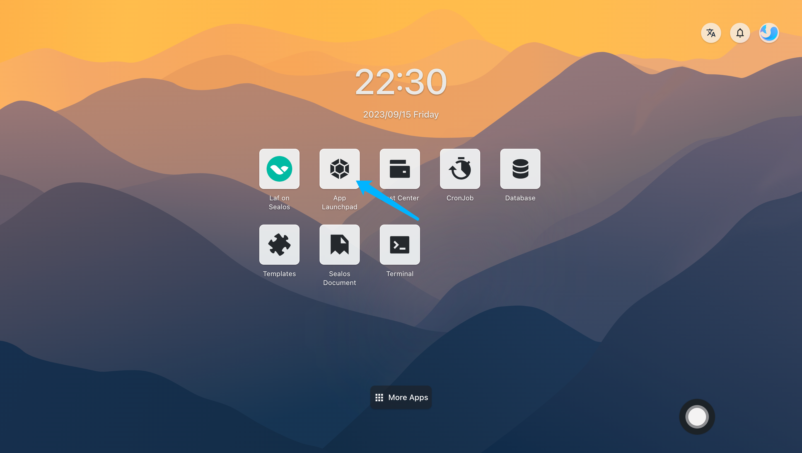
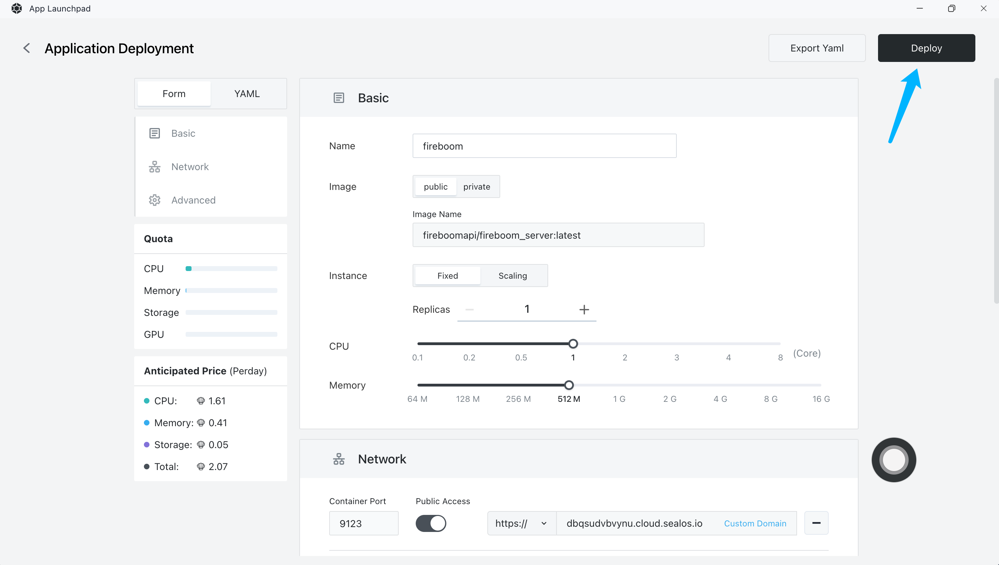
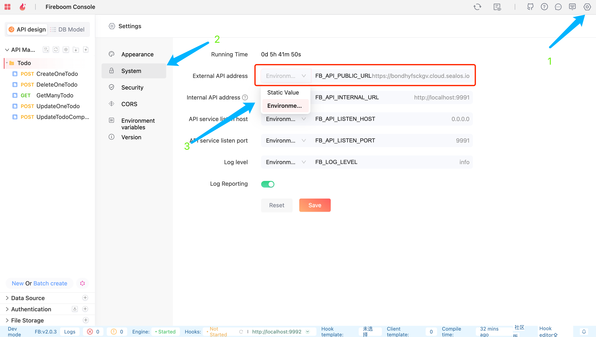
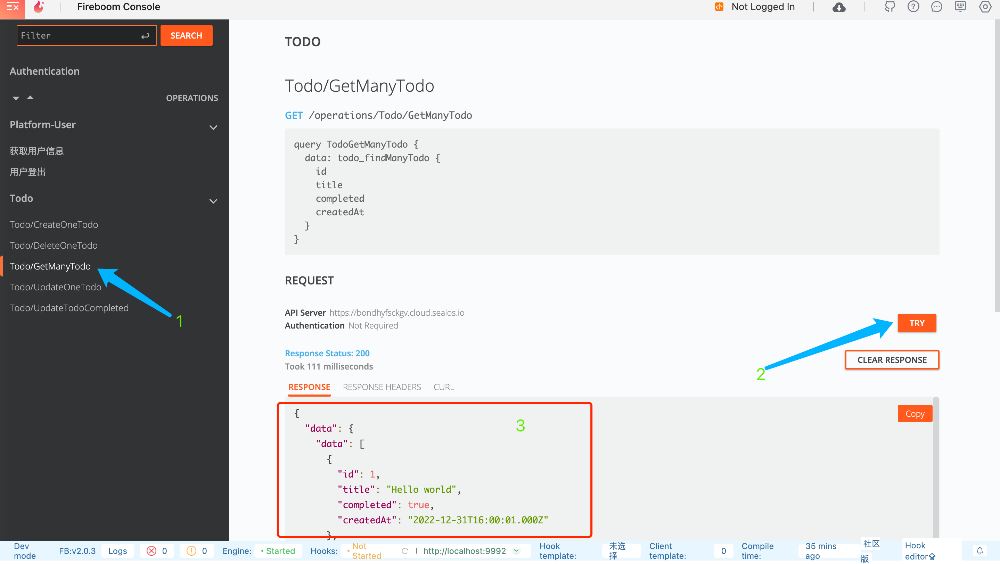

# Quick Installation of Fireboom

[Fireboom](https://fireboom.cloud) is a visual API development platform designed for developers, providing a declarative development framework, a visual editing suite, and a hook mechanism.


Official website: https://fireboom.cloud

**Features**

```
- Minute-level delivery: Reduce the interface development time from 2 days to 2 minutes in traditional mode.

- Front-end to full-stack: Visual development significantly reduces the threshold for interface development, allowing front-end developers to easily become full-stack developers.

- Back-end without bricklaying: Declarative programming avoids copy and paste, reduces the probability of bugs, and allows back-end developers to focus on business development.
```

## Step 1: Create a New Application

- Open the "Application Management" application in the [Sealos](https://cloud.sealos.io) desktop environment.



- In "Application Management", click "Create New Application" to create a new application.


## Step 2: Application Deployment

- Basic Configuration:
  
  - Application Name (custom): fireboom
  
  - Image Name (default latest version): fireboomapi/fireboom_server:latest
  
  - CPU (recommended): 2 Core (minimum 1 Core)
  
  - Memory (recommended): 4 G (minimum 512 M)

- Deployment Mode:
  
  - Number of Instances (custom): 1


- Network Configuration:
  
  - Control Panel: 9123
  - API Endpoint: 9991, enable external access


- Advanced Configuration:

  - Command Settings:
    - Parameter Settings: dev (dev for development mode, start for production mode)
  
  - Persistent Storage:

    - Metadata: /fbserver/store
    - Uploaded Files: /fbserver/upload


## Step 3: Deploy the Application

1. Click "Deploy Application" to start deploying the application.



2. Click "Details" to check. When the STATUS of the application changes from Pending to Running, it means that the application has been successfully launched.


## Step 4: Access the Application

- Access the Control Panel: Domain corresponding to 9123


- Access the API Endpoint: Domain corresponding to 9991

```
status ok
```

## Step 5: Configure Fireboom (optional)

After setting, you can easily use the Swagger document~

1. View the public address of the API: Settings -> System



2. Modify it to the public domain of the API endpoint, corresponding to 9991

    - Static Value: Select static value and set it to the public domain of the **API Endpoint**
    - Environment Variable: Go to Environment Variables, find FB_API_PUBLIC_URL and set it to the public domain of the **API Endpoint**


3. Use the Swagger document to test the API

